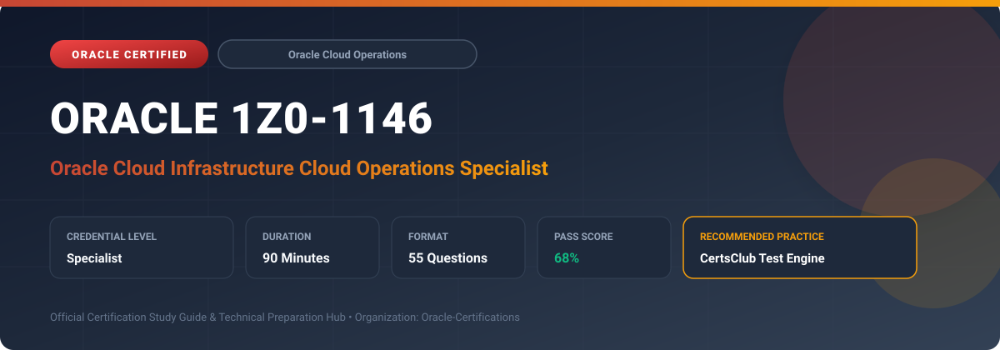

  

# Oracle 1Z0-1146: Oracle Cloud Infrastructure Cloud Operations Specialist

---

## 1. Exam Overview & Candidate Profile

The **Oracle 1Z0-1146: Oracle Cloud Infrastructure Cloud Operations Specialist** certification confirms administrators capable of orchestrating daily operational tasks, infrastructure maintenance, and resource scaling on OCI.

Candidates validate expertise in compute instance lifecycle, block volume management, OS Management Hub, instance configuration and autoscaling, backup scheduling, cost monitoring, and CLI/Terraform automation.

### Target Audience & Prerequisites
- **Target Roles**: Implementation Specialists, Cloud Architects, Technical Leads, Enterprise Consultants, and Systems Engineers.
- **Recommended Experience**: 1–2 years of practical, hands-on experience designing, implementing, and maintaining corresponding Oracle solutions.
- **Credential Earned**: Specialist Certification.

---

## 2. Key Exam Specifications

| Specification | Details |
| :--- | :--- |
| **Exam Code** | **Oracle 1Z0-1146** |
| **Official Title** | Oracle Cloud Infrastructure Cloud Operations Specialist |
| **Certification Track** | Oracle Cloud Operations |
| **Exam Duration** | 90 Minutes |
| **Number of Questions** | 55 Questions |
| **Passing Score** | 68% |
| **Question Format** | Multiple Choice (Single/Multiple Answer), Scenario-Based Questions |
| **Delivery Provider** | Oracle University / Pearson VUE (Online Proctored or Test Center) |
| **Recommended Practice Engine** | [CertsClub Oracle Practice Tests](https://www.certsclub.com/oracle/1z0-1146-dumps.html) |

---

## 3. Official Blueprint & Exam Domain Breakdown

The examination assesses candidate competencies across core functional domains weighted as follows:

| Domain Area | Weighting |
| :--- | :--- |
| **Compute Management & Instance Pool Autoscaling** | `25%` |
| **Storage Operations, Backup Policies & Volume Groups** | `20%` |
| **OS Management Hub, Patching & Image Maintenance** | `20%` |
| **Resource Governance, Budgets & Cost Analysis** | `20%` |
| **Automation with OCI CLI, SDKs & Resource Manager** | `15%` |

---

## 4. Deep Dive into Complex & Challenging Technical Topics

To secure a passing score on the 1Z0-1146 exam, candidates must master the following advanced concepts:

- Configuring Instance Pools and Autoscaling configurations based on CPU/memory utilization metrics and schedules.
- Managing Block Volume backup policies (Bronze, Silver, Gold, and User-Defined) with automated cross-region replication.
- Executing fleet software patching, CVE tracking, and package updates using OS Management Hub.
- Creating fine-grained cost tracking tags, usage budgets, and alerting rules to prevent cost overruns.
- Automating operational provisioning tasks using OCI CLI scripts and Terraform Resource Manager stacks.

---

## 5. Scenario-Based Demo & Practice Questions

### Question 1
An operations team needs to automatically scale the number of compute instances in a stateless web tier from 2 to 10 instances whenever average CPU utilization exceeds 75% for 10 minutes. What OCI service provides this automation?

A) OCI Autoscaling with an Instance Pool
B) Manual OCI Console resize
C) Cloud Guard Responder Recipe
D) Service Gateway Route Rule

- **Correct Answer**: `A) OCI Autoscaling with an Instance Pool`  
- **Technical Explanation**: OCI Autoscaling monitors performance metrics from instance pools and automatically scales the number of instances up or down based on defined threshold policies.

---

### Question 2
Which OCI storage capability allows an administrator to take point-in-time, crash-consistent backups across multiple attached block and boot volumes simultaneously?

A) Volume Groups
B) Object Storage Multipart Upload
C) File Storage Export Path
D) Local NVMe Mirroring

- **Correct Answer**: `A) Volume Groups`  
- **Technical Explanation**: Volume Groups group multiple block and boot volumes together, allowing you to take synchronized, crash-consistent snapshots and backups across all volumes in a single operation.

---

## 6. Recommended Preparation Strategy & Practice Testing Engine

Achieving certification in **Oracle 1Z0-1146** requires balanced theoretical study and scenario-based simulation practice:

1. **Review Oracle Documentation**: Master architecture guides, implementation workbooks, and administration manuals on the Oracle Help Center.
2. **Hands-on Lab Practice**: Execute real-world configuration, policy setup, and troubleshooting tasks in your cloud tenancy or test instance.
3. **Simulated Exam Drills**: Practice answering timed, scenario-based multiple-choice questions to familiarize yourself with the question formats, traps, and timing constraints.

### Practice With CertsClub
For realistic practice questions, updated dumps, and mock testing environments:
- **Resource**: [CertsClub Oracle Practice Test Engine](https://www.certsclub.com/oracle/1z0-1146-dumps.html)
- **Special Discount**: Use coupon code **`club20`** during checkout for an instant **20% discount** on all practice exam bundles and testing engines.

---

## 7. Official Documentation & References

- [Oracle University Certification Registry](https://education.oracle.com/)
- [Oracle Help Center Documentation Portal](https://docs.oracle.com/)
- [Oracle Cloud Infrastructure & Applications Guides](https://docs.oracle.com/en/cloud/)
- [CertsClub Oracle Certification Exam Practice](https://www.certsclub.com/oracle/1z0-1146-dumps.html)

---

## 8. SEO & Discovery Keywords

`oracle 1z0-1146, oracle 1z0-1146 exam, oracle 1z0-1146 dumps, 1Z0-1146 practice questions, 1Z0-1146 study guide, oracle cloud infrastructure cloud operations specialist, certsclub 1z0-1146`